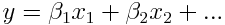
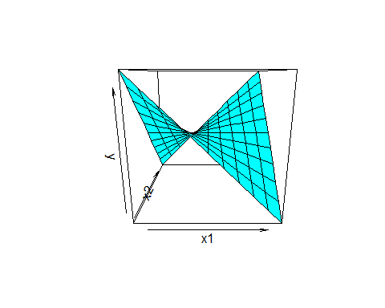
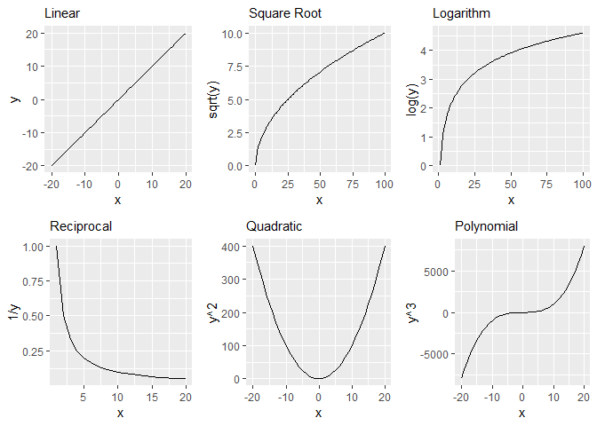
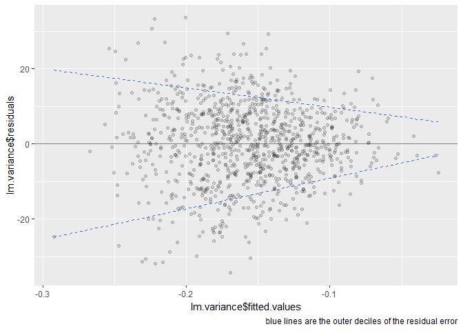
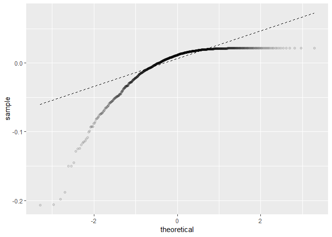

Assumptions of GLMs
================

### 1\. Validity

> The data should accurately reflect the outcome you want to measure

So-called ‘convenience samples’ are often used in research due to speed,
ease, and cost effectiveness; but increase the chance of sampling bias
if the population or outcome is not representative.

### 2\. Additive and linear

> GLMs assume that the response is the sum of linear functions of
> predictors.



Visualized below is the predicted wage from lm.wage.tidy of a
20-year-old high-school graduate (with no health insurance) using the
[Mid-Atlantic Wage Data](https://rdrr.io/cran/ISLR/man/Wage.html)
dataset. It illustrates how the estimated linear coefficients sum to the
predicted wage of 74.3.

``` r
library(tidyverse)
library(gridExtra)

# regress wage on age, highest education level, and if the worker has health insurance
lm.wage.tidy <- lm(data = ISLR::Wage, 
                   formula = wage ~ age + education + health_ins) %>%
                broom::tidy(quick=T) %>%
                mutate_if(is.numeric,round,1)

# return estimated linear coefficients
lm.wage.tidy[c(1:3,7),1:2]
```

    ## # A tibble: 4 x 2
    ##   term                estimate
    ##   <chr>                  <dbl>
    ## 1 (Intercept)             74.5
    ## 2 age                      0.5
    ## 3 education2. HS Grad      8.4
    ## 4 health_ins2. No        -18.6

<!-- -->

> GLMs can be extended to model non-additive or non-linear relationships
> by including interactions or transforming the data.

Additivity implies that coefficient effects are fixed in slope and do
not depend on other variables in the model. When additivity is violated,
then, interactions (discussed in GLMs \> Regression Coefficients)
introduce multiplicity between predictors. This allows effects to vary
accross sub-populations of one or more additional predictors.

Below is an example of how the effect of x1 may vary based on the
interaction of x2:

``` r
persp(x = -5:5, 
      y = -5:5, 
      z = outer(-5:5, -5:5), 
      zlab = 'y', xlab = 'x1', ylab = 'x2', col = 'cyan')
```

<!-- -->

When linearity is violated we may want to transform the predictors or
response to express more complicated relationships (e.g. including age +
age^2 would be useful if the effect of a predictor is more dramatic as
age increases; or log(bonus %) because you hit dimnishing rates of
return on productivity). Some
examples:

<!-- -->

**The regression coefficients become increasingly harder to interpret as
you extened assumptions of additivity and linearity.**

### 3\. Independence of errors

> The model assumes that errors are independent and give no further
> infromation about the other residuals.

For example, the units of observation may be correlated by:

  - time (temporal; e.g. seasonality)  
  - repeated measures of the same subject  
  - geo-spatial  
  - organizational (e.g. workers in the same division; members of the
    same family etc.
)  
  - etc.

### 4\. Homoscedasticity, Homogeneity of Variance, or Equal variance of errors

> The model assumes the variance of the residuals is equal

Violating this assumption (*hetero*scendasticity) does not inheriently
bias the least squares estimation of regression coefficients. However,
**test-statistics, p-values, and hypothesis testing is not possible**
because the variance-covariance matrix cannot be estimated.

Below we see the variance of the residual error decreasing over a fitted
model. The estimated standard error, then, would also decrease over the
model; and prohibit us from calculating a meaninful test-statistic about
the model as a whole.

``` r
set.seed(101)

lm.variance <- lm(data = tibble(x1 = rnorm(n=1000, mean=10, sd = 2), 
                                y = rnorm(n=1000, mean=0, sd = x1)), 
                  formula = y ~ x1)

ggplot() +
  geom_point(aes(x=lm.variance$fitted.values, 
                 y = lm.variance$residuals), alpha = .15) +
  geom_hline(aes(yintercept = 0), alpha = .5) +
  geom_quantile(aes(x=lm.variance$fitted.values, 
                    y =lm.variance$residuals), 
                quantiles = c(.1, .9), linetype =2) +
  labs(caption = 'blue lines are the outer deciles of the residual error')
```

<!-- -->

There are more robust methods of dealing with heterscendastic data; for
instance, (WLS) weighted least-squares or possibly bootstrapping.

Heteroscendastic data may be indicative of correlated errors. Serially
correlated errors would not give an unbiased coefficient estimates as I
stated above.

### 5\. Normality of errors

> Residuals should be normally distributed around the regression line

This is generally the **least important** assumption and not recommended
*(Data Analyusis Using Regression and Multilevel/Hierarchical Models -
Gelman, Hill 2008)* for diagnosing the estimation of the regression
line. It may be more important for primarily predictive models.

Below is a Q-Q (Quantile-Quantile) plot comparing the theoretical
quantiles of the normal distribution to the quantiles of the residuals
of a model with contrived non-normality of errors. A normal distribution
of residual errors would follow (more or less depending on the sample
size) the dotted-line representing a perfect 1:1 match.

``` r
set.seed(2)

lm.errors <- lm(data = tibble(x1 = rnorm(n = 1000,
                                         mean = 10,
                                         sd = 2),
                              y = log(x1)),
                formula = y ~ x1)

ggplot() +
  stat_qq(aes(sample = lm.errors$residuals), alpha = .1) +
  stat_qq_line(aes(sample = lm.errors$residuals), linetype = 2)
```

<!-- -->

### Further assumptions are needed for causal inference of coefficients (not discussed here)
