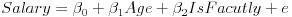
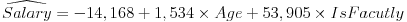
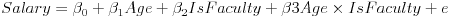
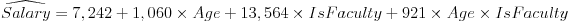

### Predictive vs Counterfactual Interpretations of Coefficients

##### Predictive
> Interpret the coefficient as differences between two individual's *holding all other predictors constant*. This is not always logistically possible when predictors co-vary or interact with each other.

##### Counterfactual
> The response **associated** with a change to an **individual**. This suggests causality and may be inappropriate.

### Multiple Predictors

Suppose a regression of Salary on Age and whether the employees is Faculty (1) vs
Staff (0):


```{r message=FALSE, warning=FALSE}
library(data.table)
library(tidyverse)

set.seed(7)
salaries <- data.table(IsFaculty = rep(x = c(0,1), each = 250),
                       Age = sample(x = 18:69, 
                                    size = 500, 
                                    replace = TRUE)) %>%
  mutate(Salary = (Age * 1000 + rnorm(n = 500, 
                                      mean = 10000, 
                                      sd = 10000)) +
                  (IsFaculty * 10000) + 
                  (IsFaculty*Age*1000))

lm.salaries <- lm(formula = Salary ~ ., data = salaries)

lm.salaries$coefficients %>% round(0)
```

The predictive interpretation of IsFaculty is that a Faculty member makes $53.9k more, on average, than a staff member of the same Age.

The counterfactual interpretation of Age is that an employee, regardless of if they are staff or faculty, will make $1.5k more Salary each year.



```{r}
ggplot(data = salaries, aes(x = Age, y = Salary)) + 
  geom_point(alpha = .25) + 
  geom_line(aes(x = Age, 
                y = lm.salaries$fitted.values, 
                group = IsFaculty, 
                color = IsFaculty))
```

### Interactions of Predictors

Note how, in the last figure, the slope of coefficient Age is forced to be the same accross sub-group IsFaculty even though the fit appears aggressive for Staff and conservative for Faculty.

Including interactions (the product of two variables) is a way to fit the model to different subsets of the data.

Suppose a regression of Salary on Age, whether the employee is Faculty (1) or Staff (0), and their interactions:



```{r}

lm.salaries.interactions <- lm(formula = Salary ~ . + Age*IsFaculty, 
                               data = salaries)

lm.salaries.interactions$coefficients %>% round(0)
```

The interaction coefficient represents the difference in regression slopes between Faculty and Staff (i.e. predicted Salary increases $921 more for Faculty each year in Age compared to Staff). Below, the slope of the regression now fits each sub-population independently.



```{r}
ggplot(data = salaries, aes(x = Age, y = Salary)) + 
  geom_point(alpha = .25) + 
  geom_line(aes(x = Age, 
                y = lm.salaries.interactions$fitted.values, 
                group = IsFaculty, 
                color = IsFaculty))
```