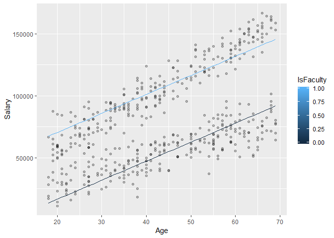
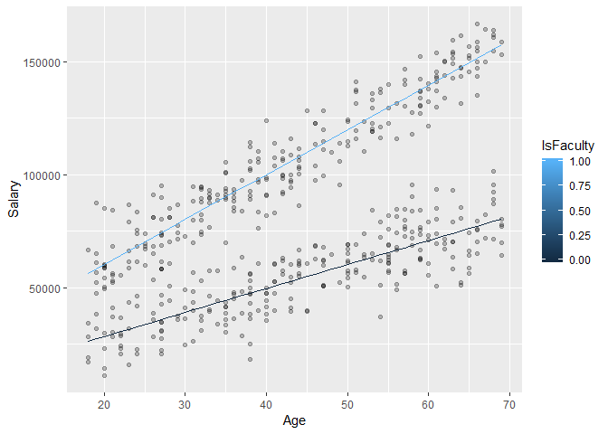

Understanding Regression Coefficients with Multiple Predictors and
Interactions
================

### Predictive vs Counterfactual Interpretations of Coefficients

##### Predictive

> The response, on average, comparing **two individuals** *holding all
> other predictors constant*. This is not always logistically possible
> when predictors co-vary or interact with each other.

##### Counterfactual

> The response **associated** with a 1 unit change to an
> **individual’s** predictor. This suggests causality and may be
> inappropriate.

### Multiple Predictors

``` r
library(data.table)
library(tidyverse)

set.seed(7)
salaries <- data.table(IsFaculty = rep(x = c(0,1), each = 250),
                       Age = sample(x = 18:69, 
                                    size = 500, 
                                    replace = TRUE)) %>%
  mutate(Salary = (Age * 1000 + rnorm(n = 500, 
                                      mean = 10000, 
                                      sd = 10000)) +
                  (IsFaculty * 10000) + 
                  (IsFaculty*Age*1000))

lm.salaries <- lm(formula = Salary ~ ., data = salaries)

lm.salaries$coefficients
```

    ## (Intercept)   IsFaculty         Age 
    ##  -14167.581   53904.575    1534.302

``` r
ggplot(data = salaries, aes(x = Age, y = Salary)) + 
  geom_point(alpha = .25) + 
  geom_line(aes(x = Age, 
                y = lm.salaries$fitted.values, 
                group = IsFaculty, 
                color = IsFaculty))
```

<!-- -->

``` r
lm.salaries.interactions <- lm(formula = Salary ~ . + Age*IsFaculty, 
                               data = salaries)

lm.salaries.interactions$coefficients
```

    ##   (Intercept)     IsFaculty           Age IsFaculty:Age 
    ##      7242.356     13564.219      1059.917       920.857

``` r
ggplot(data = salaries, aes(x = Age, y = Salary)) + 
  geom_point(alpha = .25) + 
  geom_line(aes(x = Age, 
                y = lm.salaries.interactions$fitted.values, 
                group = IsFaculty, 
                color = IsFaculty))
```

<!-- -->
