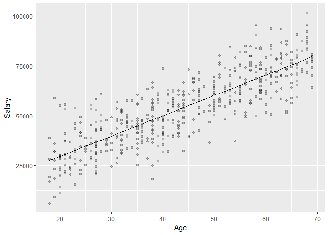

Understanding Regression Coefficients with One Predictor
================

### Binary Predictors

> The regression coefficient is the difference between the averages of
> the two groups.

Suppose a regression of Salary on whether the employee is class Faculty
(1) or Staff (0):


``` r
library(package = data.table)
library(package = tidyverse)

set.seed(7)

salaries <- data.table(IsFaculty = rep(x = c(0, 1), each = 50),
                       Salary = c(rnorm(n = 50, mean = 50000, sd = 10000),
                                  rnorm(n = 50, mean = 60000, sd = 10000)))

lm.salaries <- lm(formula = Salary ~ IsFaculty, data = salaries)

lm.salaries$coefficients %>% round(0)
```

    ## (Intercept)   IsFaculty 
    ##       52387        8000

The intercept represents the predicted value when all predictors are 0
(i.e. Staff). The regression coefficient tells us that, in our sample,
Faculty make $8k more in Salary on average than Staff.

An unbiased linear model intersects the average of each sub-population:


``` r
ggplot(data = salaries, aes(x = IsFaculty, y = Salary)) + 
  geom_point(alpha = .25) +
  geom_line(aes(x = IsFaculty, y = lm.salaries$fitted.values))
```

<!-- -->

### Continuous Predictors

> The regression coefficient is the difference between the average of
> sub-populations 1 unit apart.

or

> The regression coefficient is the slope of the prediction line at any
> level.

Suppose a regression of Salary on Age in continuous years:


``` r
set.seed(7)

salaries <- data.table(Age = sample(x = 18:69, 
                                    size = 500, 
                                    replace = TRUE)) %>%
  mutate(Salary = Age * 1000 + rnorm(n = 500, mean = 10000, sd = 10000))

lm.salaries <- lm(formula = Salary ~ Age, data = salaries)

lm.salaries$coefficients %>% round(0)
```

    ## (Intercept)         Age 
    ##        9145        1019

The intercept represents the predicted value when all predictors are 0
(i.e. Salary at birth–not very meaningful). The regression coefficient
tells us that, in our sample, employees make $1,019 more Salary on
average than employees one year their junior; or you could say that an
employee would make $10,190 more Salary on average if they were a decade
older.


``` r
ggplot(data = salaries, aes(x = Age, y = Salary)) +
  geom_point(alpha = .25) +
  geom_line(aes(x = Age, y = lm.salaries$fitted.values))
```

<!-- -->
