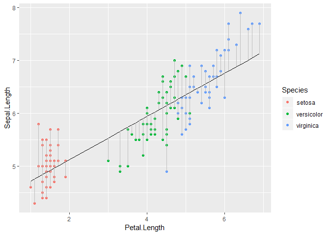

Residuals, Residual Standard Error, and R-squared
================

### Residuals

> The difference between the observed data-point and the fitted
value.

<!-- -->

### Residual Standard Error

> The average distance observations fall from the predicted model; or
> the accuracy of predictions on the same scale.

AKA ‘Sigma’

``` r
lm.iris %>% summary()
```

    ## 
    ## Call:
    ## lm(formula = Sepal.Length ~ Petal.Length, data = iris)
    ## 
    ## Residuals:
    ##      Min       1Q   Median       3Q      Max 
    ## -1.24675 -0.29657 -0.01515  0.27676  1.00269 
    ## 
    ## Coefficients:
    ##              Estimate Std. Error t value Pr(>|t|)    
    ## (Intercept)   4.30660    0.07839   54.94   <2e-16 ***
    ## Petal.Length  0.40892    0.01889   21.65   <2e-16 ***
    ## ---
    ## Signif. codes:  0 '***' 0.001 '**' 0.01 '*' 0.05 '.' 0.1 ' ' 1
    ## 
    ## Residual standard error: 0.4071 on 148 degrees of freedom
    ## Multiple R-squared:   0.76,  Adjusted R-squared:  0.7583 
    ## F-statistic: 468.6 on 1 and 148 DF,  p-value: < 2.2e-16

Regressing Sepal.Length on Petal.Length from Edgar Anderson’s Iris
dataset produces a model with sigma .4071 (i.e. can predict Sepal.Length
within an average of .41 centemeters accuracy)

### R-squared (Coefficient of Determination)

> The proportion of variance explained by the model to the total
> variance.

This can be tricky to interpret because R-squared calculation depends on
the model degrees-of-freedom (n - k) in the denominator. As it shrinks
the R-squared will go up monotonically (**e.g. as you add more predictor
coefficients the model could become so flexible the R-squared appears
“perfect”**).

Conversely, consider two models with the same regression fit, but one
with fewer observations. Sigma will be unchanged but the standard
deviation of the observations will increase, and thus R-squared will
decrease even though the models have the same fit.

``` r
set.seed(11)

example <- tibble(col1 = rnorm(n = 100, mean = 40, 10), 
                  col2 = col1 * 10 + rnorm(100,40,40))

example.restricted <- example %>% filter(between(col1,30,50))
                                     
lm.example <- lm(formula = col2 ~ col1, data = example)
lm.example.restricted <- lm(formula = col2 ~ col1, data = example.restricted)

gridExtra::grid.arrange(
ggplot(data = example, aes(x=col1, y = col2)) +
  geom_point() +
  stat_smooth(method = 'lm') +
  labs(title = 'full data', 
       subtitle = 'R-squared = .84  Sigma = 39.45 \n coef. estimate = 10.1'),
ggplot(data = example.restricted, aes(x=col1, y = col2)) +
  geom_point() +
  stat_smooth(method = 'lm')+
  labs(title = 'restricted data', 
       subtitle = 'R-squared = .70  Sigma = 38.25 \n coef. estimate = 10.25'),
ncol=2
)
```

<!-- -->

### Adjusted R-squared

Adjusted R-squared helps overcome this bias by penalizing R-squared for
a large number of predictors which do not significantly improve the
model fit.
