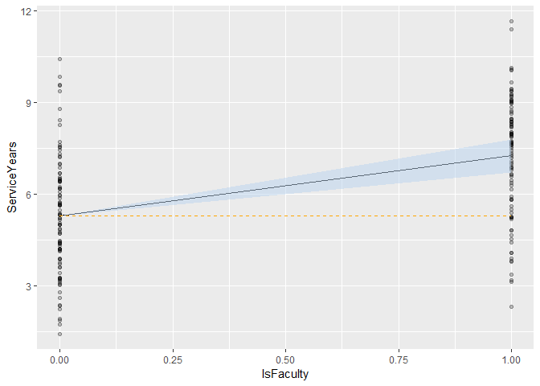

Standard Errors in Regression Coefficients
================

> Standard Error is the standard deviation of a sampling distribution

Uncertainty in the estimated regression coefficients is given by
standard errors (i.e. how much, on average, could estimated coefficients
vary from the true population coefficients).

``` r
library(tidyverse)
library(data.table)

set.seed(7)

employees <- data.table(IsFaculty = rep(x = c(0,1), each = 100),
                        ServiceYears = c(rnorm(n = 100, mean = 5, sd = 2), 
                                         rnorm(n = 100, mean = 7, sd = 2)))

lm.employees <- lm(formula = ServiceYears ~ IsFaculty, data = employees)

lm.employees.tidy <- lm.employees %>% broom::tidy() %>% as.data.table()

lm.employees.tidy
```

    ##           term estimate std.error statistic      p.value
    ## 1: (Intercept) 5.277393 0.1907826 27.661812 6.101990e-70
    ## 2:   IsFaculty 1.983490 0.2698074  7.351505 5.051088e-12

In this example regressing ServiceYears on whether the employee is
Faculty (1) or staff (0), repeated sampling of the cofficient estimates
would vary, on average, +/- .27 service years around the true population
coefficient. The interval from -.27 + 1.98 to .27 + 1.98 (+/- one SE)
would contain the true population coeficient of IsFaculty roughly 68% of
the time; ~95% for +/- two SE; ~99.7% for three SE etc.

Below, the regression line is shown with +/- two standard errors (blue).
Since this area does not contain the intercept (orange) we can conclude,
with roughly 95% confidence, that the coefficient estimate is
significantly non-zero and somewhere between 1.44 and 2.52 in the
population.

``` r
#Adjust fitted values to reflect +/- two standard errors of estimated coefficient IsFaculty and assign to employees
employees[, ":="(
  TwoSELower = lm.employees.tidy[term == "(Intercept)", estimate] +
    ((lm.employees.tidy[term == "IsFaculty", estimate] - 
      (2 * lm.employees.tidy[term == "IsFaculty", std.error])) * IsFaculty),
  TwoSEUpper = lm.employees.tidy[term == "(Intercept)", estimate] + 
    ((lm.employees.tidy[term == "IsFaculty", estimate] + 
      (2 * lm.employees.tidy[term == "IsFaculty", std.error])) * IsFaculty)
  )
]

ggplot(data = employees, aes(x = IsFaculty, y = ServiceYears)) +
  geom_point(alpha = .25) +
  geom_line(aes(y = lm.employees$fitted.values)) +
  geom_ribbon(aes(ymin = TwoSELower, ymax = TwoSEUpper),
              alpha = .5, 
              fill = "slategray2") +
  geom_line(aes(y = lm.employees.tidy[term == "(Intercept)", estimate]), 
            linetype = 2, 
            color = "orange")
```

<!-- -->
