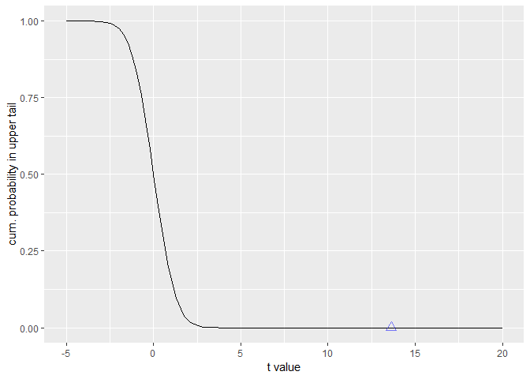

Test Statistics
================

> Test statistics are generally a ratio comparing variance **between**
> groups to variance **within** groups. When the ratio is large we
> conclude they must be from different populations.

### t values in Linear Regression

In the summary below, t values are a ratio of estimated coefficients to
their standard error (variance within group). The intercept t value of
13.63 is significantly larger than 1, and quantified by the p-value
(Pr\>|t| or the probability of obtaining an absolute t value greater
than 13.63).

``` r
summary(
  lm(formula = Sepal.Length ~ Sepal.Width, data = iris)
  )
```

    ## 
    ## Call:
    ## lm(formula = Sepal.Length ~ Sepal.Width, data = iris)
    ## 
    ## Residuals:
    ##     Min      1Q  Median      3Q     Max 
    ## -1.5561 -0.6333 -0.1120  0.5579  2.2226 
    ## 
    ## Coefficients:
    ##             Estimate Std. Error t value Pr(>|t|)    
    ## (Intercept)   6.5262     0.4789   13.63   <2e-16 ***
    ## Sepal.Width  -0.2234     0.1551   -1.44    0.152    
    ## ---
    ## Signif. codes:  0 '***' 0.001 '**' 0.01 '*' 0.05 '.' 0.1 ' ' 1
    ## 
    ## Residual standard error: 0.8251 on 148 degrees of freedom
    ## Multiple R-squared:  0.01382,    Adjusted R-squared:  0.007159 
    ## F-statistic: 2.074 on 1 and 148 DF,  p-value: 0.1519

Calculate the p-value manually using a cumulative probability
distribution, the t value, and the model degrees-of-freedom:

``` r
pt(q = c(abs(13.63)), df = 148, lower.tail = FALSE)
```

    ## [1] 3.188623e-28

Student’s T distribution is used because it is more conservative in the
tails when n \< 30. When n \> 30 it behaves similar to the normal
distribution.

``` r
library(tidyverse)

ggplot() +
  geom_line(aes(x = seq(from = -5, to =20, length.out = 100), 
                y = pt(q = seq(from = -5, to =20, length.out = 100), 
                df = 148, 
                lower.tail = FALSE))) +
  geom_point(aes(x = 13.63, 
                 y = pt(q = c(abs(13.63)), 
                 df = 148, 
                 lower.tail = FALSE)), 
             color = 'blue', 
             alpha = .5, 
             size = 3, 
             shape = 2) +
  xlab(label = 't value') +
  ylab(label = 'cum. probability in upper tail')
```

<!-- -->

### Degrees of Freedom

> The degree to which the model is free to move about or vary.

Degrees of freedom in the model are the number of data-points minus the
number of estimated coefficients.

E.g. if I have 7 hats and wear a different hat each day of the week, I
have six degrees of freedom because, on the final day, I have no choice
in which hat to wear.
